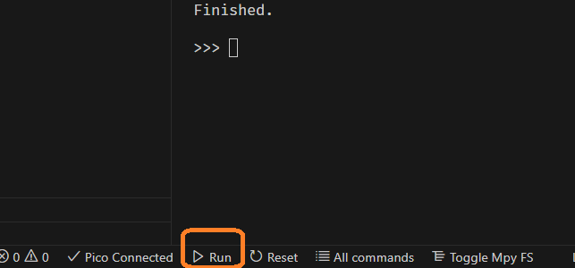
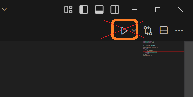

# MECH_Steuerungsentwicklung

Repository with the code and setup for the control software development part of the
mechatronics module at HSLU

## Getting started

Connect your Raspberry Pi Pico to a USB port on your machine. 

Make sure you have opened the project with VSCode. Now open the file `hello_pico.py`
in the folder `01_getting_started`. To run this code on the Rasperry Pi Pico, use
the "Run"-button at the bottom of the VSCode window:

> [!IMPORTANT]
> Note that the usual "Run"-button on the top right of VSCode will not work for
> running RaspberryPi Pico code:
> 
> 